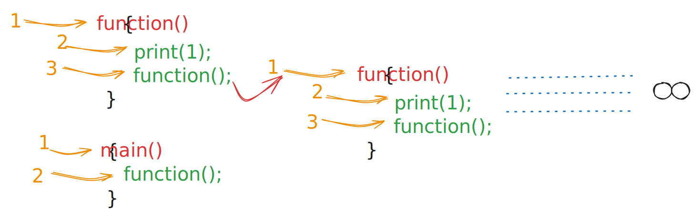
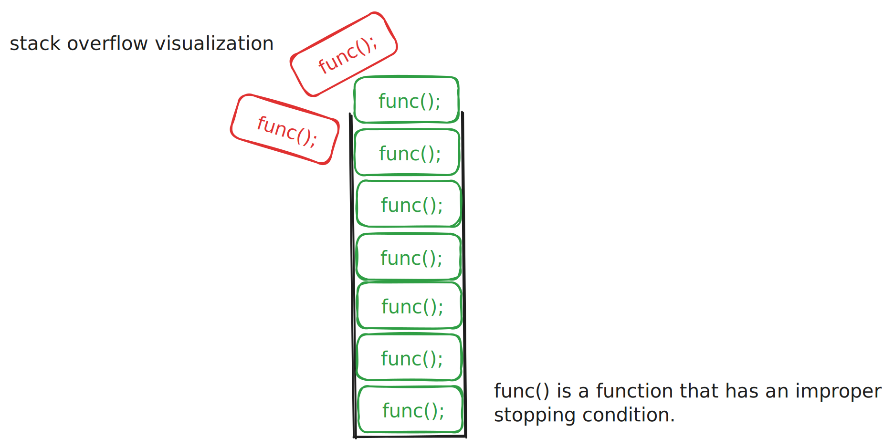

# Recursion

- When a function calls itself until a specific condition is met, it is called a recursive function.
- The process of a function calling itself is called recursion.

## Basic Terms in Recursion

- **Base Case**: The condition under which the recursion ends.
- **Recursive Case**: The part of the function that includes the recursive call.
- **Depth of Recursion**: The number of times the recursive function calls itself.

## Infinite Recursion

`specific condition` mentioned above is very important. If the condition is not met, the function will keep calling itself infinitely. This is called infinite recursion.

- Infinite recursion can cause the stack to overflow.
- It is important to have a base case to stop the recursion.



## Stack Overflow

- Stack is a memory area that stores the function call.

Stack overflow occurs when the stack is full and there is no space to store the function call.



## Parameterised and Functional Recursion

- **Parameterised Recursion**: The function takes one or more parameters. The parameters are used to calculate the answer.

- **Functional Recursion**: The function does not take any parameters. The function itself returns the answer.

Example - Checking if string is palindrome

```cpp

bool is_palindrome(std::string str, int i)
{
    if (i >= str.length() / 2)
        return true;

    if (str[i] == str[str.length() - i - 1])
        return is_palindrome(str, i + 1);
    else
        return false;
}

```

## Multiple Recursion Calls

- When a function calls itself more than once, it is called multiple recursion.

```cpp
void sample() {
    sample();
    sample();
}
```
